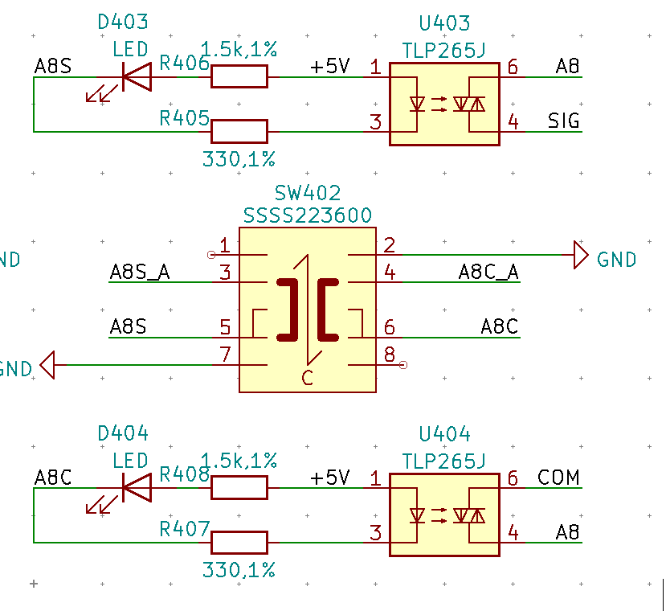

# Multipads Debugging

## 问题1：大量开关贴反

如图，开关是8脚的双刀三掷，1/8浮空，2/7接地；控制端接3和4，C位时3-5通，4-6通；此时如果`AxS`驱动到地，则`Ax`和`SIG`接通，如果`AxC`驱动到地，则`Ax`和`COM`接通；对固件而言，不应该`AxS`和`AxC`同时驱动。MCU是通过一个数字三极管驱动这两个信号的，即原理图上对应的`AxS_B`和`AxC_B`是拉高。

如果这个开关装反，在C位时完全对称，也就是不影响通过MCU控制光耦可控硅，但是开关拨到另外两侧没有作用，但也不会损坏MCU，因为`AxS_A`连接的是三极管的Collector引脚，这个引脚是耐压和高阻的，不会引起光耦可控硅的发光管打开。

## 问题2：一块板子在所有开关置于C位时，有两个单元的Signal一侧LED亮

开关分别是406和305，一个贴对了一个贴反了但是对C位而言贴反与否不重要。

305对应的控制网络是B5S_A（Q45）和B5C_A（Q46），406对应的控制网络是A4S_A（Q65）和A4C_A（Q66）。

经检查电压，Q45和Q65电压异常。所有其它控制网络上的数字晶体管的输出脚（Collector，pin 3）是4.16V，即5V驱动经过一个LED后的开路电压；Base控制脚的电压是0，因为数字晶体管内部Base有下拉。但Q45和Q65量得的输入脚电压均为960mV，输出脚电压分别是1.44V~1.5V和1.6V~1.68V，意味着管子已经打开，有电流经过LED和光耦可控硅里的IR LED。TLP265J的IR LED的压降是1.27V（min 1V，max 1.4V），(5 - 1.5 - 1.27)V / 330ohm ~= 6.76mA，此时可控硅已经导通。

B5S_B对应Pin 110，PA15，A4S_B对应Pin 134，PB4。需进一步检查代码看为什么这两个脚输出了960mV电压。

根据 https://electronics.stackexchange.com/questions/359468/problem-with-stm32f3-custom-circuit

PA15和PB4在上电后默认不是GPIO模式，是JTAG模式所以输出了电压。

